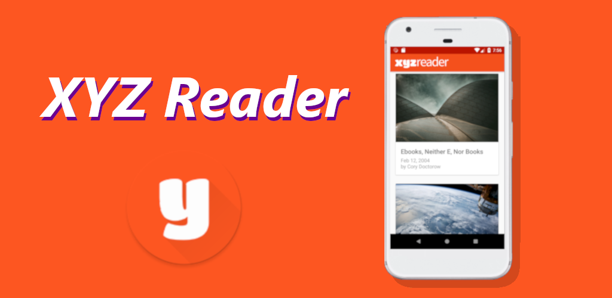
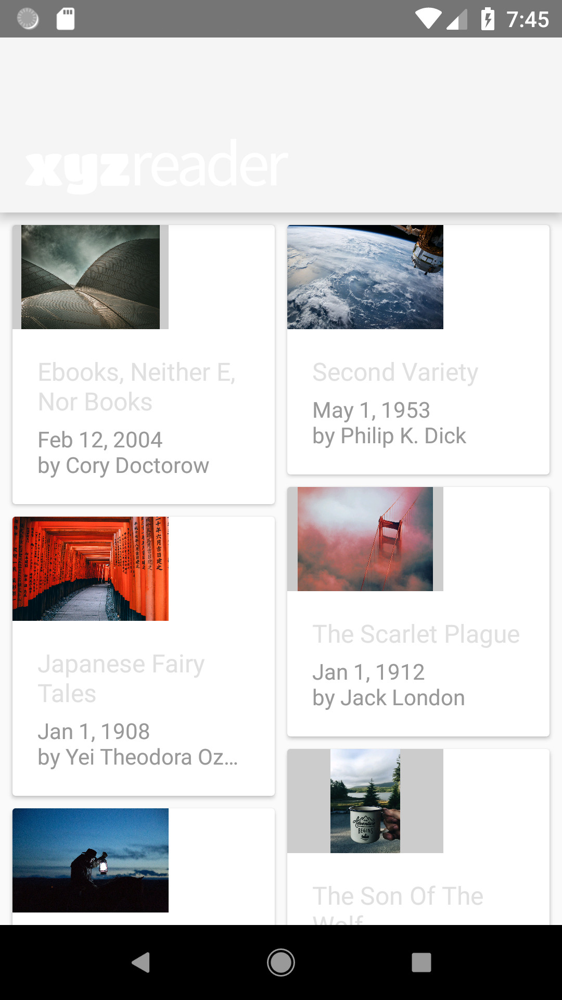
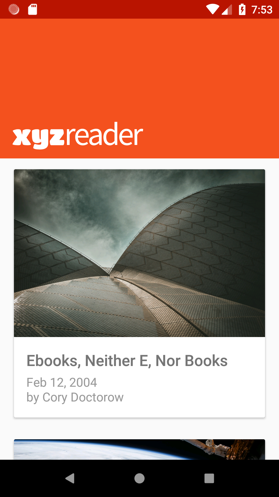
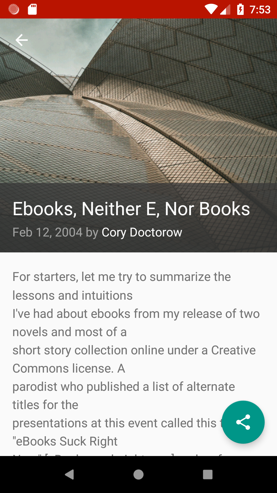

# XYZ Reader



<a href='https://play.google.com/store/apps/details?id=io.github.artenes.xyzreader&pcampaignid=MKT-Other-global-all-co-prtnr-py-PartBadge-Mar2515-1'></a>

Android application to browse a short list of articles from a remote endpoint. This application was an exercise to improve the UI from [Udacity's XYZ Reader](https://github.com/udacity/xyz-reader-starter-code).

# Features

- Browse articles
- Read articles
- Share articles (shares nothing)

# Screenshots

## Then

<p float="left" align="center">
  
  
</p>

## Now

<p float="left" align="center">
  
  
</p>

# Setup

Clone the repository

````
git clone git@github.com:Artenes/XYZ-Reader.git
````

And import the project in Android Studio and run the application